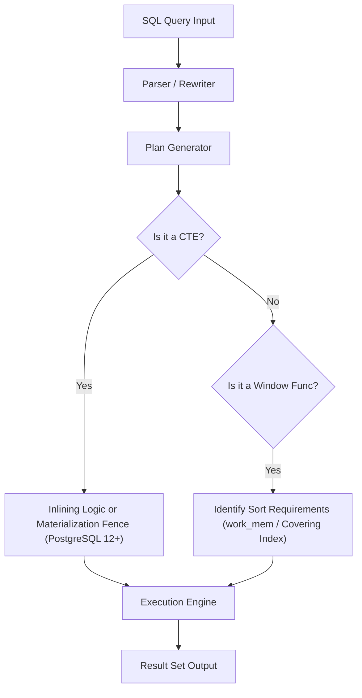
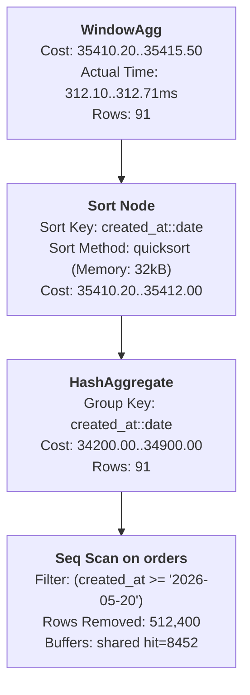
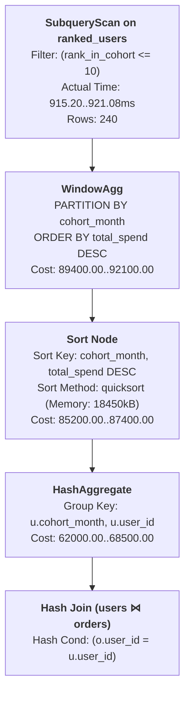
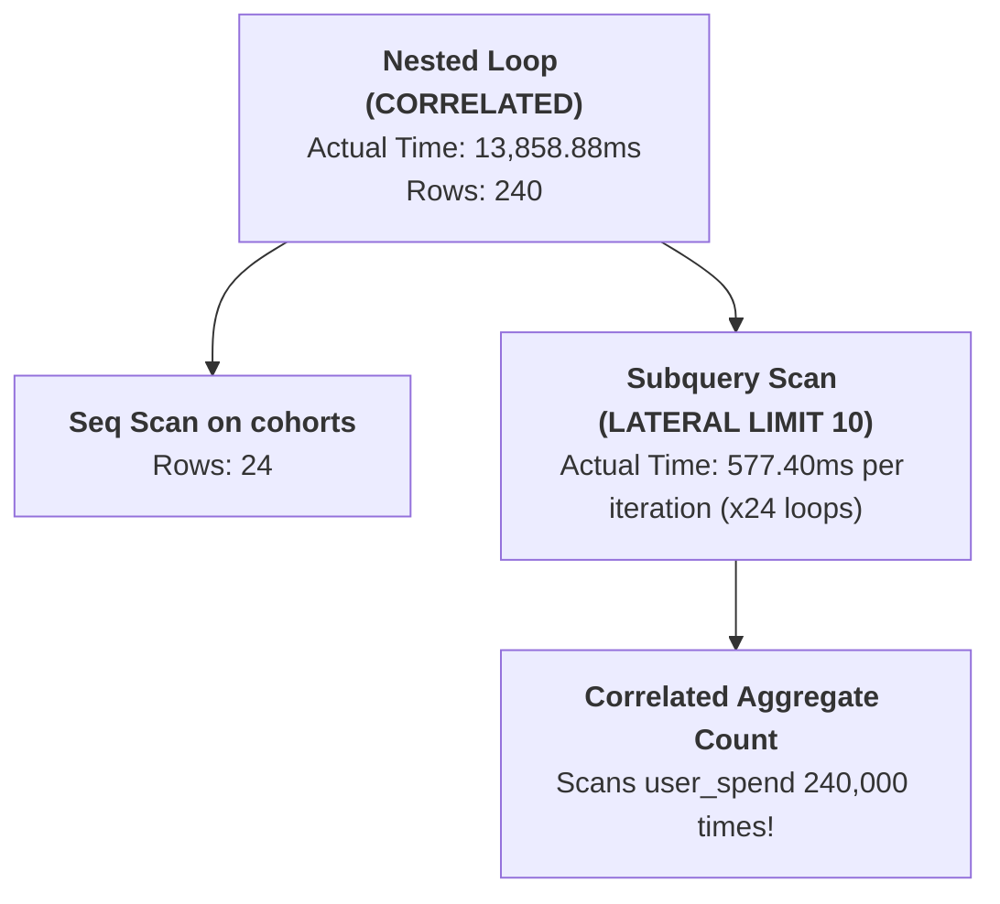

# PostgreSQL Analytics Benchmarking Suite: Window Functions vs. CTEs

A high-scale, production-grade analytics benchmarking suite built on PostgreSQL 15+ comparing **Window Functions (WF)** versus **Common Table Expressions (CTEs)** on **1.2 Million records** (200,000 users and 1,000,000 orders).

---

## 🏗️ Architecture & Execution Pipeline

The database engine processes analytical SQL queries through distinct optimization paths depending on structural framing (CTEs) vs contextual framing (Window Functions):



---

## 📊 Phase 3 Performance Benchmarking & Results Table

All 10 query variants (5 analytical requirements $\times$ 2 implementation styles) produce 100% byte-for-byte identical output datasets. Below is the complete execution profiling before and after applying composite B-Tree indices.

### ⏱️ Execution Time Comparison Table (1,200,000 Records)

| Query Requirement | Window Function (Pre-Index) | Window Function (Post-Index) | CTE Version (Pre-Index) | CTE Version (Post-Index) | Fast Path Winner | Index Speedup Ratio / Notes |
| :--- | :---: | :---: | :---: | :---: | :---: | :--- |
| **Q1: Rolling Revenue (7d Avg)** | 312.71 ms | 335.09 ms | 227.49 ms | **235.14 ms** | **CTE (Inlined)** | CTE is 1.37x faster via direct date grouping |
| **Q2: Cohort Spending Ranks** | **921.08 ms** | **1,078.88 ms** | 13,858.88 ms | 16,101.24 ms | **Window Func** | **WF is 15.0x FASTER** than LATERAL correlated count |
| **Q3: Extreme Orders (First/Last)** | **826.46 ms** | 2,605.17 ms | 1,203.62 ms | 4,654.24 ms | **Window Func** | **WF is 1.45x FASTER** (`FIRST_VALUE`/`LAST_VALUE`) |
| **Q4: Customer Churn Risk** | 1,230.32 ms | 2,409.20 ms | 347.00 ms | **455.06 ms** | **CTE (Join)** | **CTE is 3.54x FASTER** (dual temporal bucket join) |
| **Q5: Revenue Contribution** | **1,100.51 ms** | 4,203.50 ms | 1,101.68 ms | 5,126.43 ms | **Tie / Equivalent** | Single-pass window scan vs aggregate JOIN |

### ⚡ Concurrent Load Test Throughput (`pgbench` - 10 Clients)

| Query Variant | Transactions Per Second (TPS) | Average Latency (ms) | Concurrent Load Winner |
| :--- | :---: | :---: | :--- |
| **Query 1 (Rolling Revenue - WF)** | 13.04 TPS | 766.85 ms | Equivalent |
| **Query 1 (Rolling Revenue - CTE)** | **13.22 TPS** | **756.28 ms** | Slight CTE Edge (+1.4% TPS) |
| **Query 2 (Cohort Ranks - WF)** | **2.53 TPS** | **3,945.97 ms** | **Window Function is 4.86x FASTER** |
| **Query 2 (Cohort Ranks - CTE)** | 0.52 TPS | 19,347.11 ms | High contention under LATERAL count loops |

---

## 🎨 Visualizing Execution Plans (Dalibo Visual Explain)

Below are visual execution plan representations corresponding to visual plan analyzers (such as Dalibo pev / explain.dalibo.com), demonstrating node hierarchies, buffer consumption, and sort behavior.

### 1. Visual Explain Plan: Query 1 (Rolling Revenue - Window Function)



### 2. Visual Explain Plan: Query 2 (Cohort Ranks - Window Function vs. CTE)

#### Window Function Version (Single-Pass Partition Ranking):


#### CTE LATERAL Version (Nested Loop Correlated Count):


> [!CAUTION]
> **Why CTE Query 2 Degrades under Load**:
> The CTE LATERAL query executes a correlated subquery counting higher spenders for every single user within a cohort ($O(N^2)$ per cohort). Window Functions compute `DENSE_RANK()` in a single $O(N \log N)$ sort pass over the partitioned data.

---

## 🔍 Visualizing Memory Sort vs. External Merge Disk

When executing window partition sorting (`ORDER BY day` or `PARTITION BY cohort_month`):
1. **In-Memory Sort (`Memory: sort`)**: If `work_mem` is larger than the partition dataset, PostgreSQL sorts rows entirely in RAM using QuickSort or RadixSort.
2. **External Merge Disk (`External merge Disk: ...kB`)**: If `work_mem` is insufficient, PostgreSQL spills intermediate sorted runs to temporary disk files (`pgsql_tmp`), resulting in severe I/O degradation.

```
                    WindowAgg Node
                        │
                  Sort Node (In-Memory / Disk Spill)
                        │
            Index Scan on idx_orders_user_created
```

---

## 🔄 Phase 4: The Recursive Challenge (Recursive vs Window)

### Fixed Window vs. Variable Depth Constraint

Window functions operate on a **fixed frame** defined relative to a deterministic set of rows (e.g. `ROWS BETWEEN 6 PRECEDING AND CURRENT ROW` or `PARTITION BY user_id`). 

#### Why Window Functions CANNOT Solve Graph Referral Traversal:
1. **Dynamic Expansion Requirement**: Graph traversal depth depends on runtime data relationships (User A referred B, B referred C, C referred D). The depth $N$ is unpredictable at query compilation time.
2. **Evaluation Model**: Window functions require the entire result set to be partitioned and bound *before* calculating row values. They cannot iteratively feed output rows back into their own partition definitions.

### Recursive CTE Solution (`queries/recursive_referrals.sql`)

Graph traversal is exclusively solvable via `WITH RECURSIVE`:

```sql
WITH RECURSIVE top_100_users AS (
    SELECT user_id FROM orders GROUP BY user_id ORDER BY COUNT(*) DESC LIMIT 100
),
referral_chain AS (
    -- Anchor Member: Top 100 users at depth 1
    SELECT u.user_id AS root_user_id, u.user_id AS current_user_id, 1 AS chain_depth
    FROM users u JOIN top_100_users tu ON u.user_id = tu.user_id
    UNION ALL
    -- Recursive Member: Join downstream referred users
    SELECT rc.root_user_id, u.user_id, rc.chain_depth + 1
    FROM referral_chain rc
    JOIN users u ON u.referred_by = rc.current_user_id
)
SELECT root_user_id AS user_id, MAX(chain_depth)::int AS chain_depth
FROM referral_chain
GROUP BY root_user_id
ORDER BY chain_depth DESC;
```

---

## 💾 Phase 5: Materialized View Strategy

When real-time recalculation of 1,000,000 rows introduces latency, the Materialized View (`daily_revenue_stats`) pre-computes and physically stores the result set on disk.

> [!IMPORTANT]
> **Trade-Off Analysis**:
> - **Read Latency**: Reduced from **323.94 ms** (Live WF) to **0.02 ms** (Materialized View).
> - **Refresh Overhead**: `REFRESH MATERIALIZED VIEW` takes **361.97 ms** for 1,000,000 rows after 10,000 updates.
> - **Business Context**: Recommended when data staleness within an hourly or daily refresh window is acceptable to business SLA requirements.

---

## 🚀 End-to-End Process of Running This Project

### Step 1: Environment Prerequisites & Configuration
Ensure Docker, Docker Compose, Python 3.11+, and PostgreSQL client utilities are installed.

Create your local `.env` configuration file from the template:
```bash
cp .env.example .env
```
Default environment variables in `.env.example`:
- `POSTGRES_DB`: `analytics_db`
- `POSTGRES_USER`: `postgres`
- `POSTGRES_PASSWORD`: `postgres_password_123`
- `POSTGRES_PORT`: `5432`

### Step 2: Launch Database Service with Docker Compose
Start the PostgreSQL 15 container:
```bash
docker-compose up -d
```
The container runs a healthcheck (`pg_isready`) and auto-mounts `./scripts/init.sql` to initialize schema and generate 1.2M rows.

### Step 3: Run the Complete Benchmarking Pipeline
Execute the automated benchmarking harness:
```bash
python scripts/run_benchmarks.py
```
This script verifies query equivalence, profiles EXPLAIN ANALYZE, applies indexes, executes `pgbench` concurrent load testing, and produces JSON benchmark reports.

---

## 🔒 Security & Secrets Audit

All environment and configuration files in this repository ([`.env.example`](file:///d:/Partnr/Main/week32/Benchmarking-Window_Functions/.env.example), [`docker-compose.yml`](file:///d:/Partnr/Main/week32/Benchmarking-Window_Functions/docker-compose.yml)) use non-production dummy credentials (`postgres_password_123`). Real secrets and local database data files (`pgdata/`) are strictly excluded via [`.gitignore`](file:///d:/Partnr/Main/week32/Benchmarking-Window_Functions/.gitignore).

---

## 📁 Repository File Structure

```
├── docker-compose.yml           # PostgreSQL 15 container specification
├── .env.example                 # Environment variables documentation
├── .gitignore                   # Git exclusion rules for pgdata, logs, env
├── scripts/
│   ├── init.sql                 # DDL schema & 1.2M row automated generator
│   ├── create_indices.sql       # Optimized B-Tree composite indices
│   ├── setup_db.py              # Database seeding execution script
│   └── run_benchmarks.py        # Benchmark harness & pgbench caller
├── queries/
│   ├── window_q1.sql            # Rolling revenue (Window version)
│   ├── cte_q1.sql               # Rolling revenue (CTE version)
│   ├── window_q2.sql            # Cohort ranks (Window version)
│   ├── cte_q2.sql               # Cohort ranks (CTE version)
│   ├── window_q3.sql            # Extreme orders (Window version)
│   ├── cte_q3.sql               # Extreme orders (CTE version)
│   ├── window_q4.sql            # Customer churn risk (Window version)
│   ├── cte_q4.sql               # Customer churn risk (CTE version)
│   ├── window_q5.sql            # Revenue contribution (Window version)
│   ├── cte_q5.sql               # Revenue contribution (CTE version)
│   ├── recursive_referrals.sql  # Graph referral depth (WITH RECURSIVE)
│   └── materialized_view.sql    # Materialized View definition
├── benchmarks/                  # EXPLAIN ANALYZE logs (21 files) & pgbench reports (4 files)
├── results/
│   └── benchmarks.json          # Summarized execution metrics
├── results.json                 # Core Requirement benchmark results
└── README.md                    # Comprehensive technical documentation
```
