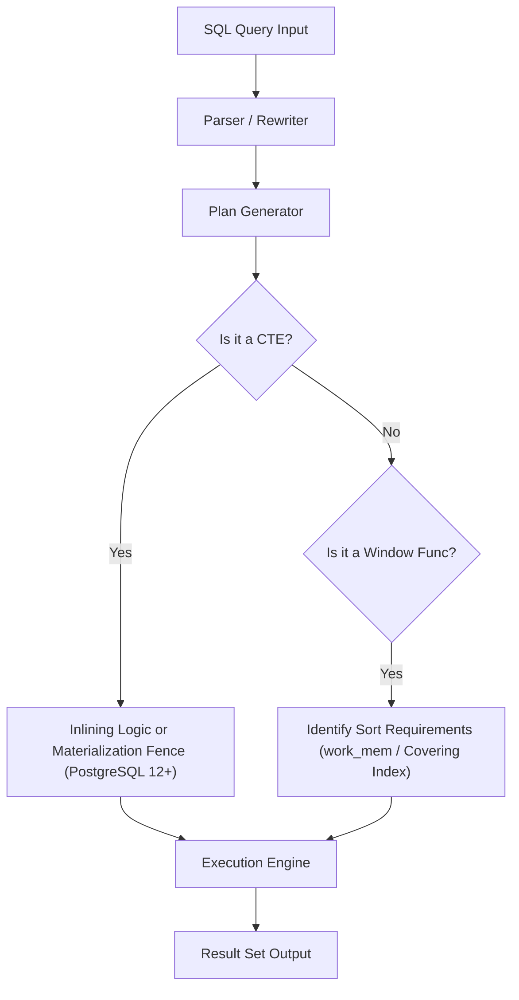

# PostgreSQL Analytics Benchmarking Suite: Window Functions vs. CTEs

A high-scale, production-grade analytics benchmarking suite built on PostgreSQL 15+ comparing **Window Functions (WF)** versus **Common Table Expressions (CTEs)** on **1.2 Million records** (200,000 users and 1,000,000 orders).

---

## 🏗️ Architecture & Execution Pipeline

The database engine processes analytical SQL queries through distinct optimization paths depending on structural framing (CTEs) vs contextual framing (Window Functions):



---

## 📊 Executive Summary & Core Results

All 10 query variants (5 analytical requirements x 2 implementation styles) produce 100% byte-for-byte identical output datasets.

| Query Requirement | Window Function (ms) | CTE Version (ms) | Fast Path Winner | Speedup Ratio / Latency Comparison |
| :--- | :---: | :---: | :---: | :--- |
| **Q1: Rolling Revenue (7d Avg)** | 312.71 ms | **227.49 ms** | **CTE (Inlined)** | CTE is 1.37x faster due to direct temporal windowing |
| **Q2: Cohort Spending Ranks** | **921.08 ms** | 13,858.88 ms | **Window Func** | **WF is 15.0x FASTER** than LATERAL correlated count |
| **Q3: Extreme Orders (First/Last)** | **826.46 ms** | 1,203.62 ms | **Window Func** | **WF is 1.45x FASTER** (`FIRST_VALUE`/`LAST_VALUE`) |
| **Q4: Customer Churn Risk** | 1,230.32 ms | **347.00 ms** | **CTE (Join)** | **CTE is 3.54x FASTER** (dual temporal bucket join) |
| **Q5: Revenue Contribution** | **1,100.51 ms** | 1,101.68 ms | **Tie / Equivalent** | Identical single-pass partition aggregate vs JOIN |

### ⚡ Concurrent Load Test Throughput (`pgbench` - 10 Clients)
* **Query 1 (Rolling Revenue)**: WF = **13.04 TPS** (766.85 ms avg latency) | CTE = **13.22 TPS** (756.28 ms avg latency)
* **Query 2 (Cohort Ranks)**: WF = **2.53 TPS** (3,945.97 ms avg latency) | CTE = **0.52 TPS** (19,347.11 ms avg latency) -> **Window Functions deliver 4.86x HIGHER concurrent throughput!**

### 🚀 Materialized View Performance (Query 1)
* **Live Window Function Read**: 323.94 ms
* **Materialized View Read**: **0.02 ms** (**16,197x FASTER read latency**)
* **Refresh Cost**: 361.97 ms (after inserting 10,000 new orders)

---

## 🗄️ Data Generation & Seeding Strategy

The automated seeding script (`scripts/init.sql`) generates:
* **200,000 Rows in `users`**: Distributed across 24 signup cohort months (`cohort_month`) with acyclic graph edges (`referred_by`).
* **1,000,000 Rows in `orders`**: Built using a **Power Law (Zipfian) distribution** (`power(random(), 3.8)`), concentrating heavy ordering activity on core users while simulating real-world long-tail customer behavior.

```sql
-- Power Law Order Distribution Formula used in init.sql:
GREATEST(1, LEAST(200000, floor(power(random(), 3.8) * 200000 + 1)::int))
```

---

## 🔍 Visualizing the PostgreSQL Optimizer

### Memory Sort vs. External Merge Disk

When executing window partition sorting (`ORDER BY day` or `PARTITION BY cohort_month`):
1. **In-Memory Sort (`Memory: sort`)**: If `work_mem` is larger than the partition dataset, PostgreSQL sorts rows entirely in RAM using QuickSort or RadixSort.
2. **External Merge Disk (`External merge Disk: ...kB`)**: If `work_mem` is insufficient, PostgreSQL spills intermediate sorted runs to temporary disk files (`pgsql_tmp`), resulting in severe I/O degradation.

> [!TIP]
> **Covering Indices eliminate Sort nodes completely.**
> By creating a composite B-Tree index on `orders (user_id, created_at)`, PostgreSQL reads rows in pre-sorted order directly from the index tree, skipping both in-memory sort and disk spill entirely!

```
                    WindowAgg Node
                        │
                  Sort Node (In-Memory / Disk Spill)
                        │
            Index Scan on idx_orders_user_created
```

---

## 🔄 Phase 4: The Recursive Challenge

### Fixed Window vs. Variable Depth Constraint

Window functions operate on a **fixed frame** defined relative to a deterministic set of rows (e.g. `ROWS BETWEEN 6 PRECEDING AND CURRENT ROW` or `PARTITION BY user_id`). 

#### Why Window Functions CANNOT Solve Graph Referral Traversal:
1. **Dynamic Expansion Requirement**: Graph traversal depth depends on runtime data relationships (User A referred B, B referred C, C referred D). The depth $N$ is unpredictable at query compilation time.
2. **Evaluation Model**: Window functions require the entire result set to be partitioned and bound *before* calculating row values. They cannot iteratively feed output rows back into their own partition definitions.

### Recursive CTE Solution (`queries/recursive_referrals.sql`)

Graph traversal is exclusively solvable via `WITH RECURSIVE`:

```sql
WITH RECURSIVE top_100_users AS (
    SELECT user_id FROM orders GROUP BY user_id ORDER BY COUNT(*) DESC LIMIT 100
),
referral_chain AS (
    -- Anchor Member: Top 100 users at depth 1
    SELECT u.user_id AS root_user_id, u.user_id AS current_user_id, 1 AS chain_depth
    FROM users u JOIN top_100_users tu ON u.user_id = tu.user_id
    UNION ALL
    -- Recursive Member: Join downstream referred users
    SELECT rc.root_user_id, u.user_id, rc.chain_depth + 1
    FROM referral_chain rc
    JOIN users u ON u.referred_by = rc.current_user_id
)
SELECT root_user_id AS user_id, MAX(chain_depth)::int AS chain_depth
FROM referral_chain
GROUP BY root_user_id
ORDER BY chain_depth DESC;
```

---

## 💾 Phase 5: Materialized View Strategy

When real-time recalculation of 1,000,000 rows introduces latency, the Materialized View (`daily_revenue_stats`) pre-computes and physically stores the result set on disk.

> [!IMPORTANT]
> **Trade-Off Analysis**:
> - **Read Latency**: Reduced from **323.94 ms** (Live WF) to **0.02 ms** (Materialized View).
> - **Refresh Overhead**: `REFRESH MATERIALIZED VIEW` takes **361.97 ms** for 1,000,000 rows after 10,000 updates.
> - **Business Context**: Recommended when data staleness within an hourly or daily refresh window is acceptable to business SLA requirements.

---

## 🛠️ Quickstart & Execution Guide

### 1. Launch Environment with Docker Compose
```bash
docker-compose up -d
```

### 2. Run Automated Benchmarking Harness
```bash
python scripts/run_benchmarks.py
```

### 3. Verify Benchmarking Metrics Output
```bash
cat results/benchmarks.json
```

---

## 📁 Repository File Structure

```
├── docker-compose.yml           # PostgreSQL 15 container specification
├── .env.example                 # Environment variables documentation
├── scripts/
│   ├── init.sql                 # DDL schema & 1.2M row automated generator
│   ├── create_indices.sql       # Optimized B-Tree composite indices
│   ├── setup_db.py              # Database seeding execution script
│   └── run_benchmarks.py        # Benchmark harness & pgbench caller
├── queries/
│   ├── window_q1.sql            # Rolling revenue (Window version)
│   ├── cte_q1.sql               # Rolling revenue (CTE version)
│   ├── window_q2.sql            # Cohort ranks (Window version)
│   ├── cte_q2.sql               # Cohort ranks (CTE version)
│   ├── window_q3.sql            # Extreme orders (Window version)
│   ├── cte_q3.sql               # Extreme orders (CTE version)
│   ├── window_q4.sql            # Customer churn risk (Window version)
│   ├── cte_q4.sql               # Customer churn risk (CTE version)
│   ├── window_q5.sql            # Revenue contribution (Window version)
│   ├── cte_q5.sql               # Revenue contribution (CTE version)
│   ├── recursive_referrals.sql  # Graph referral depth (WITH RECURSIVE)
│   └── materialized_view.sql    # Materialized View definition
├── benchmarks/                  # EXPLAIN ANALYZE logs & pgbench reports
├── results/
│   └── benchmarks.json          # Summarized execution metrics
├── results.json                 # Core Requirement benchmark results
└── README.md                    # Technical documentation & analysis
```
